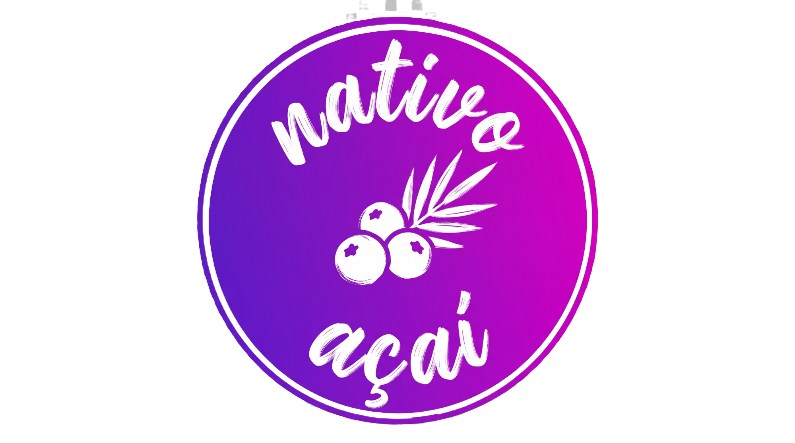
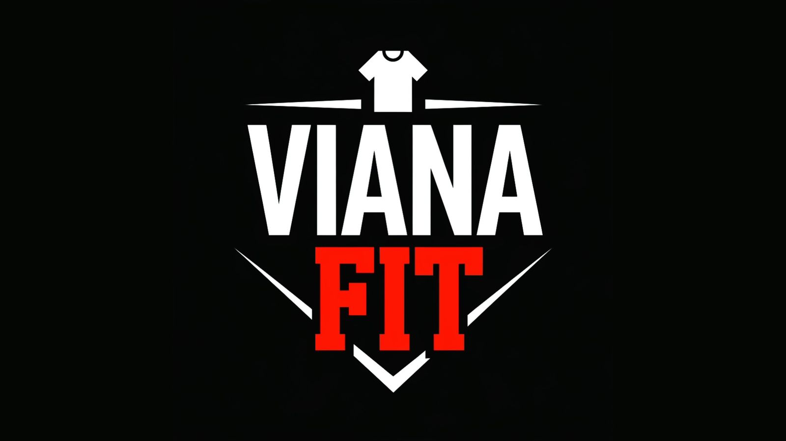

 

 

# Olá! 👋 Sou o Guilherme Almeida da Silva

**Desenvolvedor Web | Estudante de Análise e Desenvolvimento de Sistemas**

Sou um desenvolvedor web focado em criar aplicações eficientes e interfaces modernas, atualmente baseado em Fortaleza, Ceará. Estou sempre em busca de novos desafios para aprimorar minhas habilidades em front-end, back-end e banco de dados.

### 🚀 Sobre Mim
- 🎓 Estudante de Análise e Desenvolvimento de Sistemas (ADS).
- 💻 Tenho experiência no desenvolvimento de catálogos eletrônicos, cardápios digitais e painéis administrativos.
- ⚙️ Utilizo ferramentas como GitHub Actions e GitHub Copilot no meu fluxo de trabalho.
- 📫 Como me encontrar: [https://www.linkedin.com/in/guilherme-almeida-55177a205/] ou [guilhermealmeidze@gmail.com]

---

### 🛠️ Tecnologias e Ferramentas

**Front-end & Design:**  

**Back-end & Banco de Dados:**  

**BaaS & Integrações:**  

---

### 💼 Projetos em Destaque

<table>
  <tr>
    <td width="40%" align="center">
      <!-- Substitua o link abaixo pela URL da foto do Minha Açaiteria -->
      
    </td>
    <td width="60%">
      <h4>🍧 Minha Açaiteria</h4>
      
Aplicação web para gerenciamento e pedidos de açaiteria. Atualmente com o front-end estruturado e em desenvolvimento do back-end e painel de pedidos.

      
<strong>Progresso (50%):</strong>

      <code>[████████████████████▒▒▒▒▒▒▒▒▒▒▒▒▒▒▒▒▒▒▒▒]</code>
        
      
      
    </td>
  </tr>
  <tr>
    <td width="40%" align="center">
      <!-- Substitua o link abaixo pela URL da foto do Smoky One -->
      
    </td>
    <td width="60%">
      <h4>🍔 Smoky One</h4>
      
Um sistema de cardápio digital completo, integrado com WhatsApp e gerenciado via painel administrativo com Firebase. Funcionalidades do cardápio destacadas para facilitar a experiência do usuário.

      
    </td>
  </tr>
  <tr>
    <td width="40%" align="center">
      <!-- Substitua o link abaixo pela URL da foto do WG TECh -->
      
    </td>
    <td width="60%">
      <h4>🛒 Catálogo E-commerce (WG TECh)</h4>
      
Uma aplicação de catálogo virtual construída utilizando Supabase para gerenciamento de dados moderno e eficiente.

      
    </td>
  </tr>
  <tr>
    <td width="40%" align="center">
      <!-- Substitua o link abaixo pela URL da foto do Espasoares -->
      
    </td>
    <td width="60%">
      <h4>🏊‍♂️ Espasoares</h4>
      
Site desenvolvido para um espaço de lazer, focado em apresentar o ambiente, incluir a seção Sobre Nós e facilitar o contato para reservas.

      
    </td>
  </tr>
</table>
---

### 📊 Minhas Estatísticas no GitHub

  
  

